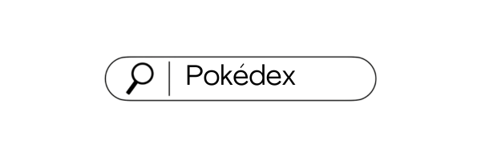

## Features
**Currently this app only has Pokémon up to Generation 4 and does not include newer Pokémon.**
- Search Pokémon by their name 
- Filter them based on their generation, type or ability
- Learn about each Pokémon
- Responsive design

## Dependencies
This project uses following dependencies:
- **React**: Library for building user interfaces.
- **Axios**: HTTP requests from PokéApi
- **React Router DOM**: Routing
- **Font Awesome**: Icons
- **React Loader Spinner**: To show loading indicators while fetching data.
- **Autoprefixer & PostCSS**: For processing CSS.

## Getting Started
Make sure you have Node.js installed on your machine. You can download it from [nodejs.org](https://nodejs.org/en)

Clone the repository:
```bash
git clone https://github.com/katjakum/pokedex-react-app.git
```
Navigate to the directory:
```bash
cd pokedex-react-app
```
Install the dependencies:
```bash
npm install
```
To run the application use:
```bash
npm run dev
```

## Usage
- When the app is running you can try to search your favourite Pokémon by their name or filter them by their type, generation or ability
- After you have found your Pokémon, you can click them and it opens up a new page containing more information than their name and dex number.